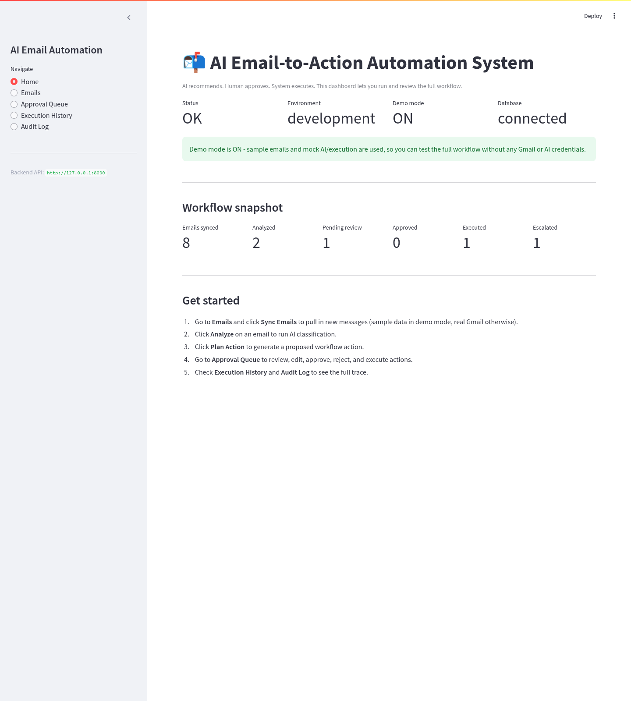
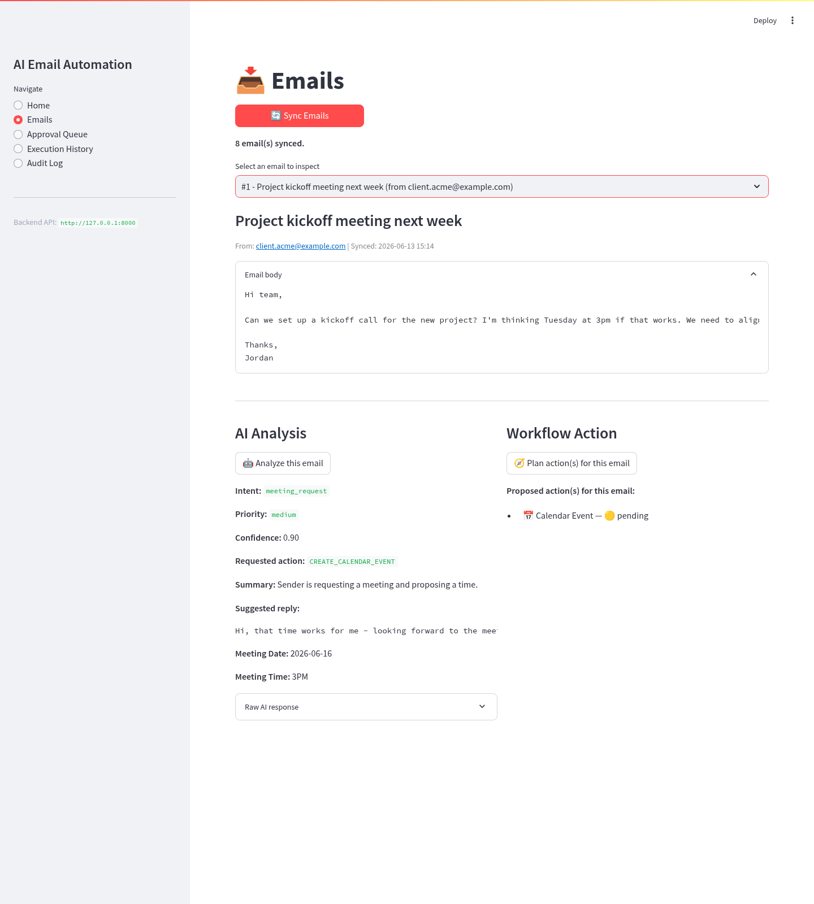
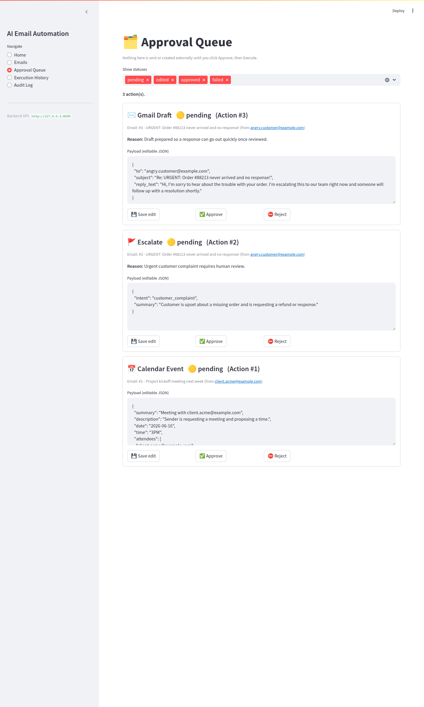
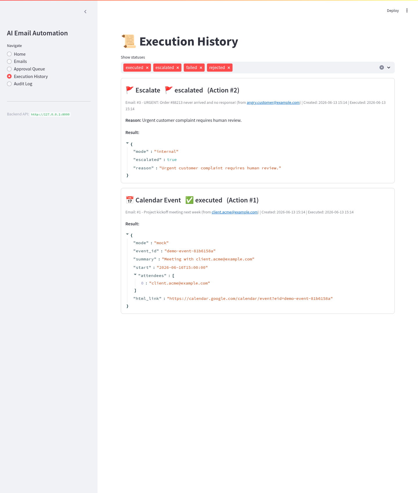
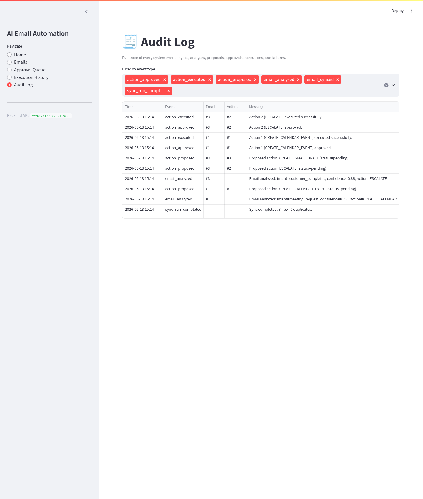
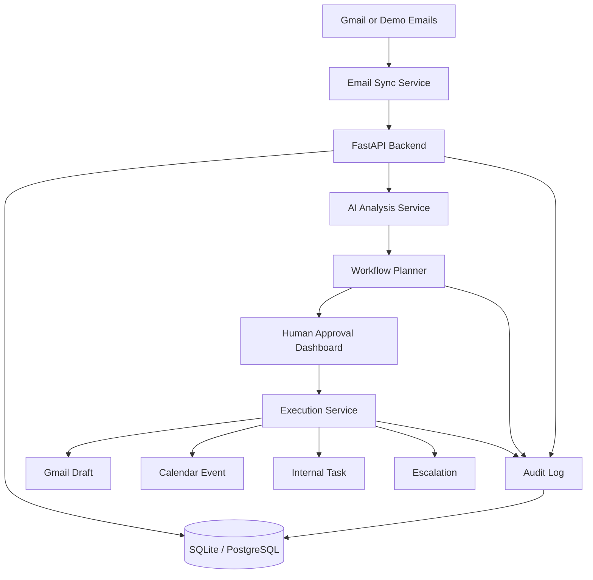

# 📬 AI Email-to-Action Automation System


> A human-in-the-loop AI automation system that reads emails, analyzes intent, plans safe workflow actions, routes them for approval, and executes approved actions with a complete audit trail.

This is not a simple chatbot demo. It is a production-style **AI workflow automation project** built around a realistic business process:

```text
Email → AI analysis → action planning → human approval → execution → audit log
```

The system runs fully in **demo mode** with 8 sample emails, mock AI analysis, mock execution, SQLite, and zero external credentials. It is also structured for real Gmail, Google Calendar, Anthropic Claude, PostgreSQL, Docker, and CI testing.

---

## Why this project matters

Most email automation tools either stop at classification or perform risky actions automatically. This project uses a safer pattern:

> **AI recommends. Human approves. System executes. Everything is logged.**

That makes it suitable for real business workflows where the AI should support decisions, not silently send emails or create calendar events without review.

---

## Core capabilities

| Area | What the system does |
|---|---|
| Email ingestion | Syncs unread emails from Gmail or built-in demo emails |
| AI analysis | Classifies intent, priority, confidence, action type, deadlines, and meeting details |
| Action planning | Converts analysis into structured workflow actions |
| Human approval | Requires approval before any action can execute |
| Safe execution | Creates mock/real Gmail drafts, calendar events, internal tasks, or escalations |
| Auditability | Logs sync, analysis, planning, approval, rejection, execution, and failure events |
| Dashboard | Streamlit interface for emails, approval queue, execution history, and audit logs |
| API | FastAPI backend with Swagger documentation |
| Testing | 33 automated tests covering planner rules, schemas, API workflow, and demo analysis |
| Deployment | Docker and docker-compose support included |

---

## Screenshots

### Dashboard Overview


### Email Analysis and Action Planning


### Human Approval Queue


### Execution History


### Audit Log


### FastAPI Swagger Documentation


---

## Architecture



### Main components

| Component | Responsibility |
|---|---|
| `app/main.py` | FastAPI application entry point |
| `app/routers/` | API routes for emails, analysis, actions, and dashboard metrics |
| `app/services/email_sync.py` | Email ingestion and duplicate prevention |
| `app/services/ai_analysis.py` | Structured AI analysis service |
| `app/services/mock_analyzer.py` | Demo-mode analyzer that works without API keys |
| `app/services/action_planner.py` | Rule engine that creates proposed workflow actions |
| `app/services/approval.py` | Approval, rejection, editing, and state transitions |
| `app/services/execution.py` | Executes approved actions safely |
| `app/services/audit.py` | Writes traceable audit events |
| `dashboard/app.py` | Streamlit dashboard |
| `tests/` | Unit and integration tests |

---

## Tech stack

| Layer | Tools |
|---|---|
| Backend | FastAPI, SQLAlchemy, Pydantic |
| Dashboard | Streamlit |
| Database | SQLite for local/demo, PostgreSQL-ready for production |
| AI | Anthropic Claude integration + mock analyzer for demo mode |
| Integrations | Gmail API, Google Calendar API |
| Testing | pytest, FastAPI TestClient |
| DevOps | Docker, docker-compose, GitHub Actions |

---

## Quick start on Windows

Use **Python 3.12**. Python 3.13 is not recommended for this project because one pinned dependency may fail during installation.

First-time setup:

```text
Double-click setup_windows.bat
```

Then run the app:

```text
1. Double-click start_backend.bat
2. Double-click start_dashboard.bat
```

Open:

```text
Dashboard: http://localhost:8501
API docs:  http://localhost:8000/docs
```

---

## Manual local setup

```bash
git clone https://github.com/YOUR_GITHUB_USERNAME/ai-email-action-automation.git
cd ai-email-action-automation

python -m venv .venv
source .venv/bin/activate        # Windows PowerShell: .venv\Scripts\Activate.ps1

pip install -r requirements.txt
cp .env.example .env              # Windows: copy .env.example .env

uvicorn app.main:app --reload
```

In a second terminal:

```bash
source .venv/bin/activate        # Windows PowerShell: .venv\Scripts\Activate.ps1
pip install -r dashboard/requirements.txt
streamlit run dashboard/app.py
```

---

## Demo workflow

After opening the dashboard:

1. Go to **Emails**.
2. Click **Sync Emails** to load 8 sample emails.
3. Select the kickoff meeting email.
4. Click **Analyze this email**.
5. Click **Plan action(s) for this email**.
6. Go to **Approval Queue**.
7. Approve and execute the proposed action.
8. Review **Execution History** and **Audit Log**.

---

## API endpoints

| Method | Endpoint | Purpose |
|---|---|---|
| `GET` | `/health` | Check app, database, and demo-mode status |
| `POST` | `/emails/sync` | Sync Gmail/demo emails |
| `GET` | `/emails` | List synced emails |
| `GET` | `/emails/{id}` | View one email and its analysis |
| `POST` | `/emails/{id}/analyze` | Run AI analysis |
| `GET` | `/emails/{id}/analysis` | Retrieve saved analysis |
| `POST` | `/emails/{id}/plan` | Create proposed action(s) |
| `GET` | `/actions` | List workflow actions |
| `GET` | `/actions/{id}` | View one action |
| `PATCH` | `/actions/{id}` | Edit pending action payload |
| `POST` | `/actions/{id}/approve` | Approve an action |
| `POST` | `/actions/{id}/reject` | Reject an action |
| `POST` | `/actions/{id}/execute` | Execute an approved action |
| `GET` | `/dashboard/metrics` | Dashboard metrics |
| `GET` | `/audit-logs` | Audit trail |

Interactive documentation is available at:

```text
http://localhost:8000/docs
```

---

## Safety design

- The system **never sends emails automatically**.
- Gmail actions create **drafts**, not sent messages.
- Actions must be approved before execution.
- Low-confidence AI output is escalated to human review.
- Unclear meeting requests create clarification drafts instead of calendar events.
- Demo mode works without Gmail, Calendar, or AI credentials.
- `.env`, `token.json`, local database files, and virtual environments are ignored by Git.

---

## Testing

Run:

```bash
pytest -v
```

Current verified test result:

```text
33 passed
```

The test suite covers:

- email sync and duplicate prevention
- mock analyzer behavior across demo emails
- schema validation
- action planning rules
- approval workflow
- execution blocking before approval
- full API workflow integration

---

## Docker

```bash
docker compose up --build
```

This starts the backend, dashboard, and database stack. See [`docs/DEPLOYMENT.md`](docs/DEPLOYMENT.md) for deployment notes.

---

## Real Gmail / Calendar / Claude configuration

The project runs in demo mode by default. To connect real services, update `.env`:

```env
DEMO_MODE=false
GOOGLE_CLIENT_ID=your_google_client_id
GOOGLE_CLIENT_SECRET=your_google_client_secret
ANTHROPIC_API_KEY=your_anthropic_api_key
```

Use a **test Gmail account**, not a personal mailbox, while developing.

---

## Resume-ready summary

```text
Built a human-in-the-loop AI email automation system using FastAPI, Streamlit,
SQLAlchemy, Gmail API, Google Calendar API, and structured LLM analysis.

Designed a safe workflow engine that classifies emails, extracts action items,
plans Gmail draft/calendar/task/escalation actions, requires human approval, and
records every step in an audit log.

Implemented demo mode, SQLite/PostgreSQL support, Docker deployment, Swagger API
documentation, CI-ready tests, and a recruiter-friendly dashboard with screenshots.
```

---

## License

MIT License. See [`LICENSE`](LICENSE).
