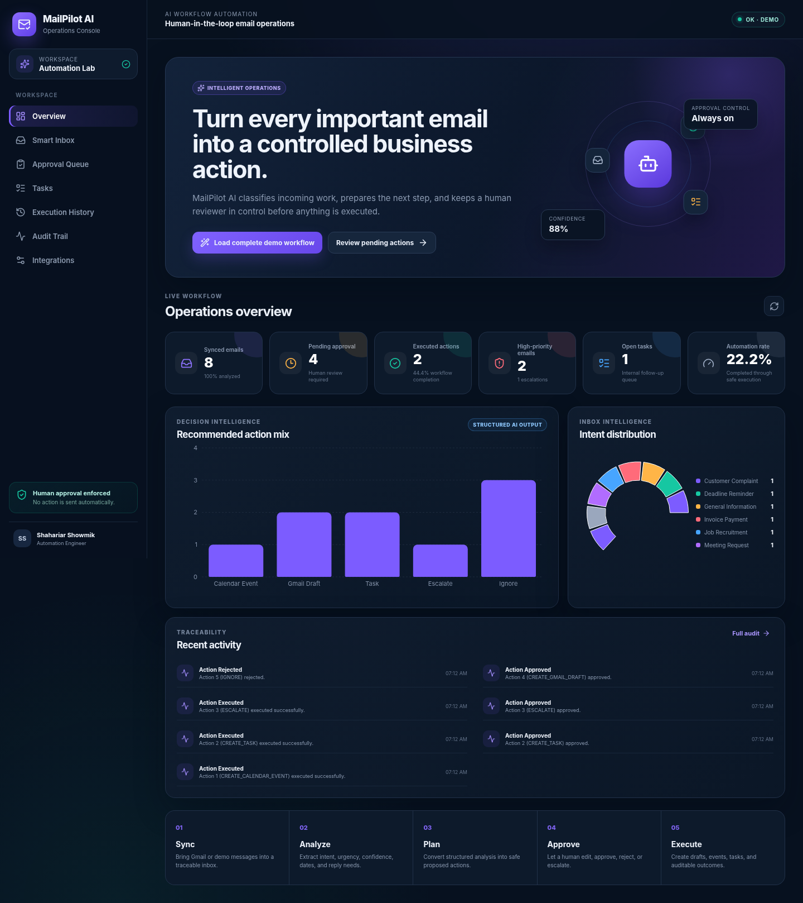
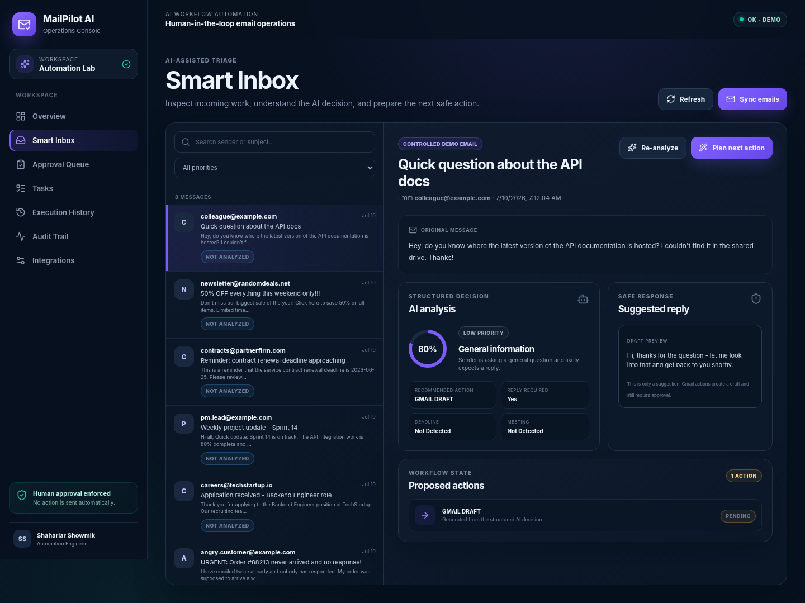
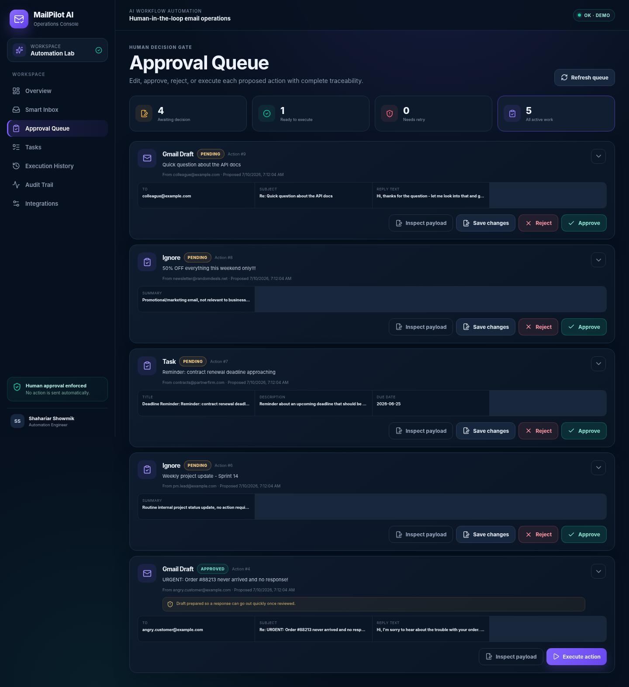
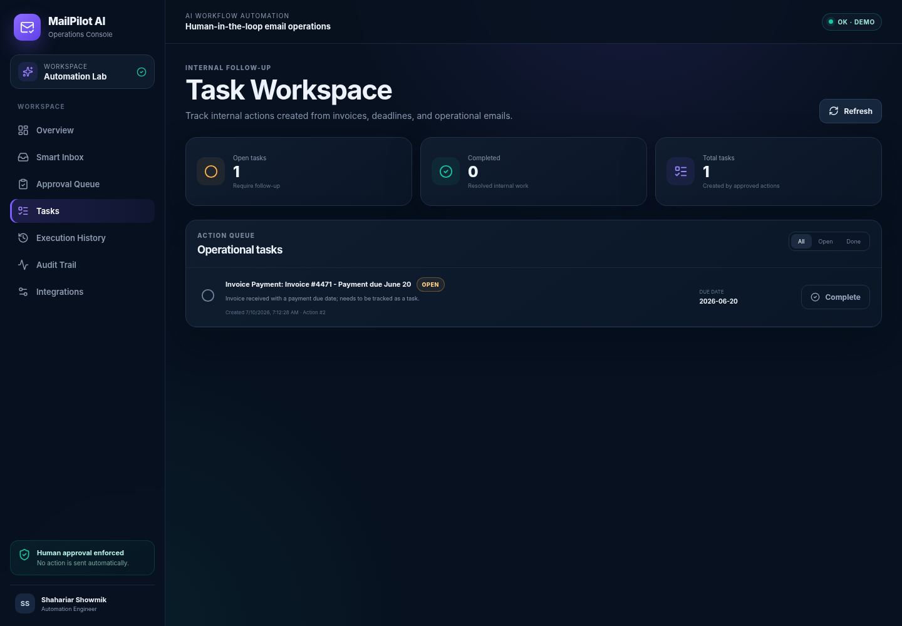
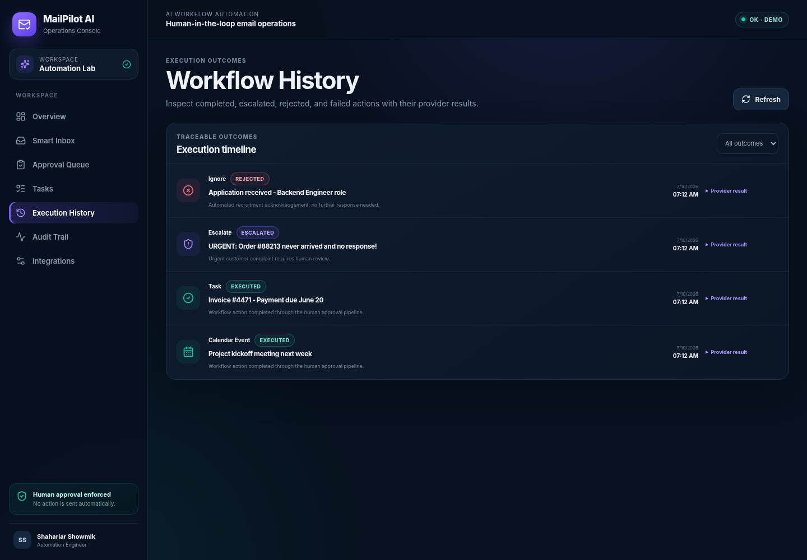
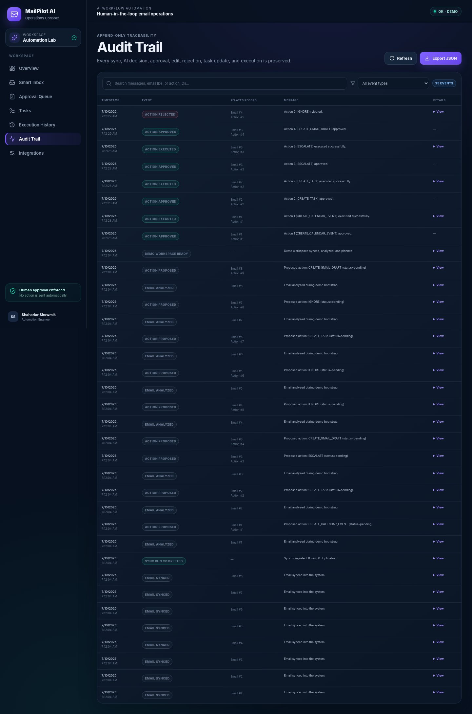
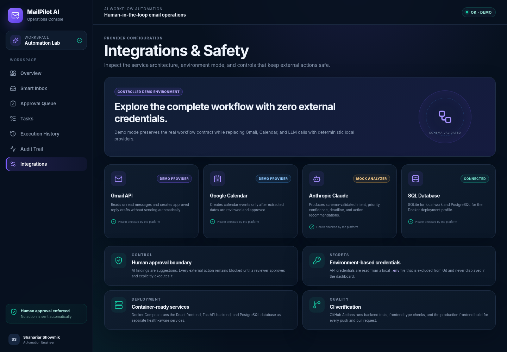
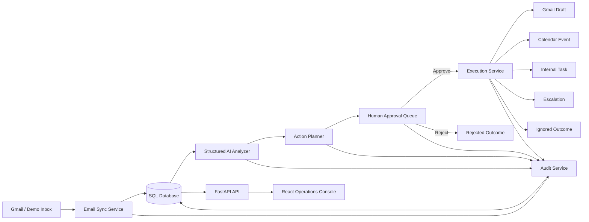

# MailPilot AI — Email-to-Action Automation Platform


> A human-in-the-loop operations platform that turns business emails into controlled drafts, calendar events, tasks, and escalations—without allowing AI to take external action on its own.

```text
Email ingestion → structured AI analysis → action planning → human approval → execution → audit trail
```

MailPilot AI is designed as an internal business automation system rather than a “paste an email into a chatbot” demo. It provides a traceable inbox, schema-validated analysis, an approval gate, operational tasks, execution history, service health, and an immutable workflow audit trail.

The repository runs end to end in **demo mode with no external credentials**. Optional adapters are included for Gmail, Google Calendar, Anthropic Claude, and PostgreSQL.

---

## Why this project exists

Business inboxes contain meetings, deadlines, complaints, invoice follow-ups, internal updates, and low-value noise. Processing them manually is repetitive, while fully autonomous AI creates unacceptable operational risk.

MailPilot AI applies a safer operating model:

> **AI recommends. A human decides. The platform executes. Every transition is recorded.**

This design demonstrates AI automation engineering, backend workflow orchestration, full-stack product development, external service integration, safety controls, testing, and CI/CD.

---

## Product capabilities

| Area | Capability |
|---|---|
| Smart inbox | Sync demo or Gmail messages into a searchable operational inbox |
| Structured analysis | Extract intent, priority, confidence, dates, meeting details, reply needs, and recommended action |
| Workflow planning | Translate analysis into typed actions with validated payloads |
| Approval queue | Edit, approve, reject, inspect, or execute proposed work |
| Safe execution | Create Gmail drafts, calendar events, internal tasks, escalations, or intentionally ignored outcomes |
| Task workspace | Track operational tasks generated from approved emails and mark them complete or reopen them |
| Operations analytics | Monitor analysis rate, automation rate, action mix, intent distribution, open work, and recent activity |
| Execution history | Review completed, failed, approved, rejected, and pending actions |
| Audit trail | Filter and inspect every significant workflow transition |
| Integration health | View demo/live provider mode, database health, safety boundaries, and deployment status |
| Demo bootstrap | Load the complete seeded workflow from one button without auto-approving any action |
| API platform | Use documented FastAPI endpoints independently of the React interface |

---

## Screenshots

All screenshots below were captured from the running application with seeded workflow data.

### Operations overview



### Smart inbox and structured AI analysis



### Human approval queue



### Internal task workspace



### Execution history



### Audit trail



### Integrations and safety controls



---

## End-to-end workflow

1. **Sync** — ingest unread Gmail messages or eight deterministic sample emails.
2. **Analyze** — generate a schema-validated analysis record for each email.
3. **Plan** — map the analysis into one or more typed workflow actions.
4. **Review** — allow a human to inspect and edit the proposed payload.
5. **Approve or reject** — enforce an explicit decision before execution.
6. **Execute** — invoke the configured Gmail, Calendar, task, escalation, or ignore provider.
7. **Track** — store execution results, internal tasks, metrics, and audit events.

The one-click **Load complete demo workflow** operation performs sync, analysis, and planning only. It deliberately does not approve or execute actions.

---

## Architecture



### Main modules

| Path | Responsibility |
|---|---|
| `app/main.py` | FastAPI entry point, CORS, health check, and router registration |
| `app/models.py` | Email, analysis, action, task, and audit persistence models |
| `app/routers/emails.py` | Email sync, list, filtering, and detail APIs |
| `app/routers/analysis.py` | Structured analysis APIs |
| `app/routers/actions.py` | Planning, editing, approval, rejection, and execution APIs |
| `app/routers/tasks.py` | Internal task listing and lifecycle APIs |
| `app/routers/dashboard.py` | Operational metrics, overview analytics, and audit APIs |
| `app/routers/demo.py` | Safe idempotent demo bootstrap workflow |
| `app/services/` | Gmail, Calendar, analysis, planning, approval, execution, and audit services |
| `frontend/src/pages/` | React operations console pages |
| `tests/` | Unit and API integration coverage |

---

## Technology stack

| Layer | Technology |
|---|---|
| Frontend | React 19, TypeScript, Vite, React Router, Recharts, Lucide icons |
| Backend | Python 3.12, FastAPI, SQLAlchemy, Pydantic |
| Local database | SQLite |
| Container database | PostgreSQL 16 |
| AI provider | Anthropic Claude adapter plus deterministic mock analyzer |
| Email integration | Gmail API adapter plus deterministic demo provider |
| Calendar integration | Google Calendar API adapter plus deterministic demo provider |
| Testing | pytest, FastAPI TestClient, TypeScript compiler, Vite build |
| DevOps | Docker, Docker Compose, Nginx, GitHub Actions |

---

## Repository structure

```text
ai-email-action-automation/
├── app/
│   ├── routers/
│   ├── schemas/
│   ├── services/
│   ├── config.py
│   ├── database.py
│   ├── main.py
│   └── models.py
├── frontend/
│   ├── src/
│   │   ├── components/
│   │   ├── pages/
│   │   ├── api.ts
│   │   ├── App.tsx
│   │   └── styles.css
│   ├── Dockerfile
│   ├── nginx.conf
│   ├── package.json
│   └── vite.config.ts
├── tests/
├── docs/
│   ├── screenshots/
│   └── DEPLOYMENT.md
├── .github/workflows/tests.yml
├── docker-compose.yml
├── setup_windows.bat
├── start_backend.bat
├── start_frontend.bat
├── run_tests.bat
└── requirements.txt
```

---

## Quick start on Windows

### Requirements

- Python **3.12 or newer**
- Node.js **20 or newer**
- Internet access during the first dependency installation

### First-time setup

Extract the repository and double-click:

```text
setup_windows.bat
```

The script:

- creates `.venv` inside the project folder;
- installs backend dependencies;
- installs frontend dependencies;
- creates `.env` from `.env.example` when missing;
- runs all backend tests; and
- validates the React production build.

### Start the platform

Open the backend in one terminal window:

```text
start_backend.bat
```

Open the frontend in a second terminal window:

```text
start_frontend.bat
```

Then visit:

```text
Operations console: http://localhost:5173
API documentation:  http://localhost:8000/docs
Health endpoint:     http://localhost:8000/health
```

### Load the complete workflow

On the Overview page, click:

```text
Load complete demo workflow
```

The platform will sync eight sample emails, analyze unprocessed messages, and create proposed actions. Continue through **Smart Inbox**, **Approval Queue**, **Tasks**, **Execution History**, and **Audit Trail**.

---

## Manual development setup

```bash
git clone https://github.com/SAHARIARSHOWMIK/ai-email-action-automation.git
cd ai-email-action-automation

python -m venv .venv
```

Activate the environment:

```powershell
.venv\Scripts\Activate.ps1
```

Install and start the backend:

```powershell
python -m pip install --upgrade pip
pip install -r requirements.txt
copy .env.example .env
$env:PYTHONPATH = (Get-Location).Path
uvicorn app.main:app --reload
```

In a second terminal, start the frontend:

```powershell
cd frontend
npm install
npm run dev
```

---

## API overview

| Method | Endpoint | Purpose |
|---|---|---|
| `GET` | `/health` | Database, environment, and demo-mode health |
| `POST` | `/demo/bootstrap` | Idempotently sync, analyze, and plan the demo workflow |
| `POST` | `/emails/sync` | Sync Gmail or sample emails |
| `GET` | `/emails` | Filter and list emails |
| `GET` | `/emails/{id}` | Retrieve an email with its analysis and actions |
| `POST` | `/emails/{id}/analyze` | Analyze one email |
| `GET` | `/emails/{id}/analysis` | Retrieve the stored analysis |
| `POST` | `/emails/{id}/plan` | Plan workflow actions |
| `GET` | `/actions` | Filter and list actions |
| `GET` | `/actions/{id}` | Retrieve one action |
| `PATCH` | `/actions/{id}` | Edit a pending action payload |
| `POST` | `/actions/{id}/approve` | Approve an action |
| `POST` | `/actions/{id}/reject` | Reject an action |
| `POST` | `/actions/{id}/execute` | Execute an approved action |
| `GET` | `/tasks` | Filter and list internal tasks |
| `POST` | `/tasks/{id}/complete` | Complete an internal task |
| `POST` | `/tasks/{id}/reopen` | Reopen an internal task |
| `GET` | `/dashboard/metrics` | Compact operational metrics |
| `GET` | `/dashboard/overview` | Aggregated dashboard analytics and recent activity |
| `GET` | `/audit-logs` | Filter the complete audit trail |

Interactive OpenAPI documentation is available at `http://localhost:8000/docs`.

---

## Safety model

- No proposed action can execute before approval.
- Gmail execution creates a **draft** rather than sending an email automatically.
- Proposed payloads can be inspected and edited before approval.
- Low-confidence or high-risk cases can be escalated for manual handling.
- The demo bootstrap never approves or executes actions.
- Credentials are stored in `.env`, which is excluded from Git.
- `token.json`, database files, build output, caches, and virtual environments are excluded from Git.
- Every significant workflow transition creates an audit record.

---

## Demo mode and live integrations

The default `.env.example` uses:

```env
DEMO_MODE=true
DATABASE_URL=sqlite:///./app.db
```

This mode uses deterministic local Gmail, AI, Calendar, and execution providers.

To configure live providers, set `DEMO_MODE=false` and supply the required Google OAuth and Anthropic values in `.env`. Never commit the `.env` file or OAuth token file.

The live integration adapters are included, but production OAuth consent, Google Cloud configuration, secret management, and provider account approval remain deployment responsibilities.

---

## Testing and quality checks

Run all local checks on Windows:

```text
run_tests.bat
```

Or run them manually:

```powershell
$env:PYTHONPATH = (Get-Location).Path
pytest -q

cd frontend
npm run lint
npm run build
```

Verified result for this version:

```text
39 passed
TypeScript check passed
Vite production build passed
```

The test suite covers:

- duplicate-safe email ingestion;
- mock analyzer classification and extraction;
- schema and confidence validation;
- action planning rules;
- approval, rejection, editing, and execution boundaries;
- internal task completion and reopening;
- demo bootstrap idempotency;
- dashboard overview aggregation;
- audit-log filtering; and
- full API workflow behavior.

---

## Continuous integration

`.github/workflows/tests.yml` runs on pushes and pull requests to `main`.

The workflow independently verifies:

1. backend dependency installation;
2. application import and startup contract;
3. all pytest tests;
4. frontend dependency installation;
5. TypeScript validation; and
6. the Vite production build.

---

## Docker deployment

Start the PostgreSQL database, FastAPI backend, and Nginx-served React frontend:

```bash
docker compose up --build
```

Open:

```text
Frontend: http://localhost:8080
Backend:  http://localhost:8000
API docs: http://localhost:8000/docs
```

Docker Compose uses PostgreSQL for persistence and service health checks before starting dependent services.

See [`docs/DEPLOYMENT.md`](docs/DEPLOYMENT.md) for environment and deployment notes.

---

## Upgrade highlights

This repository was upgraded from a basic Streamlit interface into a full React operations console while preserving the tested FastAPI workflow engine.

Major changes include:

- responsive React and TypeScript frontend;
- operations overview with charts and workflow metrics;
- split-pane smart inbox;
- editable approval queue;
- internal task lifecycle;
- execution and audit workspaces;
- integration-health and safety view;
- one-click, idempotent demo bootstrap;
- expanded backend APIs and test coverage; and
- separate frontend/backend CI jobs and production containers.

---

## Limitations

- Authentication and multi-tenant user management are not included in this portfolio release.
- Demo-mode analysis is deterministic and is not a substitute for evaluating a production LLM on organization-specific data.
- Live Google OAuth setup requires your own Google Cloud project and credentials.
- The application intentionally creates Gmail drafts and does not autonomously send email.
- Production deployments should add managed secret storage, database migrations, HTTPS, monitoring, backups, rate limiting, and organization-specific access controls.

---

## Resume-ready summary

**AI Email Action Automation | Python, FastAPI, React, TypeScript, SQLAlchemy, PostgreSQL, Gmail/Calendar APIs, LLMs, Docker**

- Built a human-in-the-loop email automation platform that converts business messages into structured Gmail drafts, calendar events, internal tasks, escalations, and traceable execution outcomes.
- Developed a React operations console and FastAPI workflow engine with schema-validated AI analysis, editable approval gates, task tracking, operational analytics, provider health, and complete audit logs.
- Implemented deterministic demo providers, optional Gmail/Calendar/Anthropic integrations, PostgreSQL deployment, Docker Compose, and automated backend/frontend CI verification.

---

## License

Released under the [MIT License](LICENSE).
